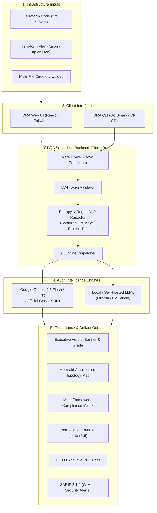

<div align="center">
  <h1 align="center">✨ Deployment Readiness Auditor (DRA)✨</h1>
  <p>
    <strong>
      <a href="https://dra.damiansztankowski.cloud/">🔴 View Live Demo</a>
    </strong>
  </p>
  <p>
    
    
    
    
  </p>
</div>

<details>
<summary><strong>⚠️ Disclaimer: AI Usage, Costs, and Data Privacy (Click to read)</strong></summary>

### 2. AI & Generative Content Warning
This tool utilizes Artificial Intelligence (e.g., Azure OpenAI, LLMs) to generate text, code, or images.

* **Accuracy:** AI models can hallucinate or produce inaccurate information. Output should never be treated as absolute fact.
* **Verification:** Users must independently verify all AI-generated content before using it in production environments.
* **Bias:** The model may reflect biases present in its training data. The authors of this repository are not responsible for the nature of the generated content.

### 3. Cost & Billing
This project requires access to cloud services (e.g., Azure AI Studio, Google Cloud Storage, OpenAI API).

* **User Responsibility:** You are solely responsible for all costs incurred by your cloud provider accounts while running this software.
* **Resource Management:** It is the user's responsibility to monitor usage and set up budget alerts. The authors are not liable for unexpected cloud bills or "runaway" processes.

### 4. Data Privacy & External Links
* **Third-Party Storage:** Some assets in this documentation (images/PDFs) are hosted on external object storage (Google Cloud Storage). Availability of these assets is not guaranteed.
* **Sensitive Data:** Do not input sensitive personal data (PII), API keys, or credentials directly into the code or prompt inputs unless you have secured the environment.

</details>

---

**Architect with Confidence. Audit with Intelligence.**

The **Deployment Readiness Auditor (DRA)** is an enterprise-grade, Google Cloud-native DevSecOps platform and CI/CD quality gatekeeper. It audits Infrastructure as Code (Terraform `.tf`, `.tfvars`, and evaluated execution plans `tfplan.json`) **before changes hit production environments**.

DRA evaluates your infrastructure against the official **Google Cloud Well-Architected Framework** across 5 core architectural pillars:
1. **Security & Compliance**
2. **Cost Optimization (FinOps)**
3. **Reliability & Disaster Recovery**
4. **Operational Excellence**
5. **Performance Efficiency**

Simultaneously, DRA cross-examines configurations against major international cybersecurity and regulatory standards (**CIS GCP Benchmark v2.0, NIST SP 800-53 Rev. 5, EU GDPR Article 32, HIPAA Security Rule, PCI DSS v4.0, and SOC 2 Type II**), issues definitive Go/No-Go deployment verdicts, projects recurring monthly FinOps waste, and generates one-click remediation patch bundles.

---

## 🌟 Key Features

- **Executive Deployment Gatekeeper**: Immediate Go/No-Go release verdicts (`🚫 BLOCKED`, `⚠️ CONDITIONAL`, `✅ PRODUCTION READY`) with blast radius indicators (`CRITICAL`, `MODERATE`, `LOW`) and maturity letter grades (`A+` to `F`).
- **Regulatory Compliance Matrix**: Standard-by-standard interactive cards and searchable tables mapping findings directly to **CIS GCP, NIST 800-53, GDPR, HIPAA, PCI DSS, and SOC 2** controls.
- **Boardroom-Ready CISO Multi-Page PDF Brief**: Multi-page executive PDF report featuring executive metrics, pillar scorecards, compliance tables, code fixes, and formal 3-party governance sign-off blocks.
- **Adaptive Dual-Theme UX**: Modern light & dark theme ergonomics with high-contrast typography, elevated card surfaces, and accessible colorways.
- **Automated Remediation Bundle ("Remediate All")**: One-click export of unified Git patches (`dra-remediation.patch` applicable via `git apply`) and consolidated HCL fixes (`remediated-infrastructure.tf`).
- **Interactive Topology Map**: Automatically visualizes infrastructure topology and risk mapping using dynamic Mermaid diagrams with zoom, pan, and full-screen inspection.
- **FinOps Intelligence & Monthly Waste Calculation**: Specifically pinpoints reclaimable cloud budget with monthly dollar waste estimates (\$/mo) and right-sizing recommendations.
- **Terraform Plan JSON Support (`tfplan.json`)**: Audits pre-deployment execution plans (`terraform show -json`) by evaluating planned resource changes (`change.after`).
- **DevSecOps & CI/CD Gatekeeping CLI (`dra-cli`)**: Standalone Go CLI with pipeline pass/fail thresholds (`--fail-on`, `--min-score`), SARIF 2.1.0 output for GitHub Security tab, and PR Markdown summaries.
- **Zero-Knowledge DLP Anonymization & Rate Limiting**: Built-in pattern redactor for project IDs, GCP service account keys, and IP addresses, plus sliding-window DoW rate limiting.

---

## 🏗️ Internal System Architecture

DRA operates as a hybrid decoupled architecture supporting both interactive web inspections and headless automated CI/CD pipeline gatekeeping:



---

## ⚙️ Configuring LLM Model Versions

DRA gives you full control over the AI model powering your audits. You can configure the model version in **4 different ways**:

### Option 1: On Google Cloud Run (Recommended for Hosted Web App)
To change the default model for all users on your deployed Cloud Run service, set the `LLM_MODEL` environment variable:

```bash
# Using gcloud CLI:
gcloud run services update dra-app \
  --region us-central1 \
  --project deployment-readiness-auditor \
  --update-env-vars="LLM_MODEL=gemini-2.5-pro"
```
Or in **Google Cloud Console**:
1. Open **Cloud Run > dra-app**.
2. Click **"Edit & Deploy New Revision"**.
3. Under **Variables & Secrets**, add `LLM_MODEL` with value `gemini-2.5-pro` (or `gemini-2.5-flash`).
4. Click **Deploy**.

### Option 2: Directly in the Web UI (Per-Audit Override)
You can test different models on the fly without restarting anything:
1. In the code input editor, click the **Settings icon** (slider toggle) in the bottom-right corner.
2. Under **"Audit Engine Settings"**:
   * Set **Provider** to **Gemini**.
   * In **"Model Name"**, enter your desired model (e.g. `gemini-2.5-pro`, `gemini-2.5-flash`).
3. Click **Run Audit**.

### Option 3: In the CLI (`dra-cli`)
When running automated terminal audits or CI/CD pipelines:
```bash
# Override Gemini model for a scan:
./dra-cli/bin/dra-cli scan --path ./terraform --llm-model="gemini-2.5-pro"

# Or audit with a local self-hosted model:
./dra-cli/bin/dra-cli scan --path ./terraform \
  --llm-provider="ollama" \
  --llm-model="gemma4:e2b" \
  --llm-url="http://localhost:11434/api/generate"
```

### Option 4: Local Server Environment Variable
When running the development server locally:
```bash
cd dra-app
LLM_MODEL="gemini-2.5-pro" API_KEY="your-gemini-api-key" npm start
```

### 🧠 Supported Model Identifiers

| Model Identifier | Recommended Use Case | Speed & Cost |
|---|---|---|
| `gemini-2.5-flash` *(Default)* | Rapid developer feedback, standard audits, automated CI/CD gates | Ultra-fast & lowest cost |
| `gemini-2.5-pro` | Complex multi-module architectures, high-stakes regulatory compliance | Deep reasoning & architecture insight |
| `gemini-1.5-pro` | Extremely large Terraform codebases & extensive `tfplan.json` files | Long context & proven stability |
| `gemma4:e2b` / `gemma` | Offline air-gapped environments via local Ollama or LM Studio | 100% local / Zero outbound data |

---

## 📋 Prerequisites

Before you begin, ensure you have the following:

1. **Google Gemini API Key**: Obtain one from [Google AI Studio](https://aistudio.google.com/).
2. **Node.js & NPM**: Installed on your local machine (v20+ recommended).
3. **Go**: v1.21+ (only required if compiling `dra-cli` from source).
4. **Google Cloud Project** (Optional): With billing enabled for serverless Cloud Run hosting.

---

## 💻 Local Development

Follow these steps to get the app running locally:

### 1. Clone the Repository
```bash
git clone https://github.com/damian-sztankowski/Deployment-Readiness-Auditor.git
cd Deployment-Readiness-Auditor
```

### 2. Install and Build
```bash
cd dra-app
npm install
npm run build
```
This bundles the TypeScript React application into optimized browser assets using **esbuild**.

### 3. Start the Development Server

#### Option A: Running with Google Gemini (Default)
```bash
API_KEY=PASTE_YOUR_GEMINI_API_KEY_HERE npm start
```

#### Option B: Running with a Local Self-Hosted LLM (e.g. LM Studio / Ollama)
```bash
# For LM Studio (OpenAI Compatible):
LLM_PROVIDER=lm-studio \
LLM_MODEL=gemma \
LLM_URL=http://127.0.0.1:9090/v1/chat/completions \
npm start

# For Ollama:
LLM_PROVIDER=ollama \
LLM_MODEL=gemma4:e2b \
LLM_URL=http://localhost:11434/api/generate \
npm start
```
Open **`http://localhost:8080`** (or `http://localhost:3000`) in your browser!

---

## 🛠️ Command Line Interface (CLI)

The **DRA CLI (`dra-cli`)** lets you scan Terraform infrastructure files directly from your terminal or automated pipelines.

### 1. Build and Install
```bash
# Build the standalone binary into ./dra-cli/bin/dra-cli
make -C dra-cli build

# (Optional) Install binary into your system Go bin path
make -C dra-cli install
```

### 2. Add to PATH
```bash
export PATH=$PATH:$(pwd)/dra-cli/bin
```

### 3. Running Scans
```bash
# Standard local scan
./dra-cli/bin/dra-cli scan --path /path/to/terraform/code

# Scanning recursively into all subdirectories
./dra-cli/bin/dra-cli scan --path /path/to/terraform/code --deep-scan
```

### 4. CI/CD Quality Gates & Automated Enforcement
```bash
# 1. Enforce zero tolerance on Critical and High risks (fails build with exit code 1):
./dra-cli/bin/dra-cli scan --path ./terraform --deep-scan --yes --fail-on critical,high

# 2. Enforce minimum architectural maturity score (e.g. 75/100):
./dra-cli/bin/dra-cli scan --path ./terraform --min-score 75

# 3. Export SARIF 2.1.0 report for the GitHub Security tab:
./dra-cli/bin/dra-cli scan --path ./terraform --output sarif --output-file dra-results.sarif

# 4. Generate an automated Git remediation patch:
./dra-cli/bin/dra-cli scan --path ./terraform --fix-patch dra-remediation.patch
git apply dra-remediation.patch
```

A production-ready GitHub Action workflow is included in [`.github/workflows/dra-audit.yml`](.github/workflows/dra-audit.yml).

---

## ☁️ Deployment to Google Cloud Run

Host DRA serverlessly on Cloud Run:

```bash
gcloud run deploy dra-app \
  --source dra-app/ \
  --region us-central1 \
  --allow-unauthenticated \
  --port 8080 \
  --set-env-vars API_KEY=PASTE_YOUR_GEMINI_API_KEY_HERE,LLM_MODEL=gemini-2.5-flash
```

> [!TIP]
> **Showcase Mode:** If you omit the `API_KEY`, the application automatically operates in **Showcase Demo Mode**, enabling stakeholder walkthroughs without live API consumption.

---

## 🛠️ How to Use

1. **Input**: Paste your `.tf`, `.tfvars`, or `tfplan.json` code into the editor, or click **"Upload Project"** to load a full directory.
2. **Analyze**: Click **"Run Audit"**.
3. **Review**:
   - Check the **Deployment Verdict Banner** for immediate Go/No-Go release decisions.
   - Inspect the **Architecture Topology Map** for dependency graphs and critical risk locations.
   - Use the **Regulatory Compliance Matrix** to view non-compliant controls across CIS, NIST, GDPR, HIPAA, and PCI DSS.
   - Review **FinOps Opportunities** for reclaimable monthly budget.
4. **Remediate**:
   - Click **"Remediation Bundle"** to export a ready-to-apply Git patch (`git apply dra-remediation.patch`) or consolidated HCL file.
5. **Report**:
   - Click **"Export Enterprise Brief"** to generate a multi-page boardroom CISO audit PDF with formal governance sign-off blocks.

---

## 🔒 Security & Privacy

- **Ephemeral Processing**: DRA does not persist your infrastructure code on any database.
- **Client-Side Secret Shielding**: Google Gemini API keys are never bundled or exposed to the browser; all queries route securely through `/api/audit`.
- **Enterprise-Grade DLP Engine**:
  - Automatically sanitizes identities (emails), VPC/IP topographies, database names, and project identifiers into semantic aliases (e.g. `PROJECT_ID_1`, `IP_RANGE_2`).
  - **Global High-Entropy Scanning**: Automatically scrubs hardcoded credentials (GCP API keys `AIzaSy...`, AWS keys `AKIA...`, and private keys) even when assigned to generic variables.
- **Hardened SSRF Protection**: Outbound proxy resolves custom domain names to block private IP ranges (RFC 1918), local loopbacks, and the GCP Link-Local Instance Metadata Server (`169.254.169.254`).
- **Sliding-Window Rate Limiting**: Built-in rate limiter protects against Denial of Wallet (DoW) with standard `Retry-After` headers.

---

## 📝 Release Notes

### v2.5.0 (Latest Milestone)
* 🚦 **Executive Deployment Verdict Banner**: Added immediate Go/No-Go gatekeeper status, blast radius indicators, maturity letter grades, and 4 KPI summary cards.
* 📜 **Multi-Framework Regulatory Compliance Matrix**: Added interactive standard-by-standard breakdown for CIS GCP Benchmark v2.0, NIST SP 800-53, EU GDPR, HIPAA, PCI DSS, and SOC 2 with real-time search.
* 📄 **CISO Boardroom PDF Brief**: Completely overhauled multi-page PDF generation with dark cover page, clearance stamp, pillar scorecard, compliance matrix, FinOps waste breakdown, technical observations with HCL code snippets, and formal 3-party governance sign-off blocks.
* 🎨 **Dual-Theme Design System**: Polished white/light theme ergonomics alongside obsidian dark mode with WCAG-compliant high-contrast typography.
* 🩹 **Automated Remediation Bundle**: Added one-click export of unified Git patches (`dra-remediation.patch`) and consolidated HCL files (`remediated-infrastructure.tf`).
* 🗺️ **Mermaid Topology Map**: Interactive cloud architecture dependency graph with zoom, pan, and full-screen inspection.
* 📄 **Terraform Plan JSON (`tfplan.json`) Support**: Audit planned infrastructure changes before execution (`terraform show -json`).
* 🤖 **CLI CI/CD Gatekeeping**: Automated `--fail-on` and `--min-score` flags, SARIF 2.1.0 output for GitHub Security alerts, and turnkey GitHub Action workflow.
* 🛡️ **API Rate Limiting**: Sliding-window rate limiter protecting `/api/audit` against runaway usage.

---

## 📄 License

Distributed under the MIT License. See `LICENSE.md` for more information.

---

<p align="center">
  <a href="https://github.com/damian-sztankowski">
    
  </a>
</p>

> [!NOTE]
> **Independent Tool**: This project is a community contribution and is not officially endorsed or maintained by Google.
